# bootstrapnet

## Overview

R package for resampling network metrics/indices (bootstrapping without replacement).

It wraps around the [bipartite][bip] package functions `networklevel` and `specieslevel`. 

Assuming a network/web like `Safariland` from the bipartite package:

``` r
library(bipartite)
data(Safariland)
```
One can sample interactions without replacement from the network until all interactions have been used. The sampling procedure starts with a small sample size to which interactions are added until all are consumed. Every time we sample interactions, a smaller version of the entire network can be built and a network index/metric can be computed. The sampling procedure can be repeated as many times as needed, giving the possibility to compute mean values with quantile-based confidence intervals. The mean values across sample sizes can be plotted and indices of different networks can be visually compared. See examples below.

[bip]: https://cran.r-project.org/web/packages/bipartite/index.html


## Installation

You can install `bootstrapnet` from GitHub with:

``` r
# install.packages("devtools")
devtools::install_github("valentinitnelav/bootstrapnet")
```

## Examples

### Network-level indices (metrics)

#### Resample two networks with computing "nestedness".

``` r
library(bootstrapnet)
library(bipartite)
library(magrittr)
data(Safariland)

# Generate two fictive networks to compare

set.seed(321)
Safariland_1 <- Safariland[, sort(sample.int(ncol(Safariland), 20))]
set.seed(123)
Safariland_2 <- Safariland[, sort(sample.int(ncol(Safariland), 20))]


# Resample the two networks with computing "nestedness". The computation is
# carried in parallel.

lst_nest <- list(s1 = Safariland_1, s2 = Safariland_2) %>%
  lapply(web_matrix_to_df) %>%
  boot_networklevel(col_lower = "lower", # column name for plants
                    col_higher = "higher", # column name for insects
                    index = "nestedness",
                    level = "both", # here, nestedness is not affected by level
                    start = 20,
                    step = 10,
                    n_boot = 100,
                    n_cpu = 3)
# approx. 1 min of CPU time

gg_networklevel(lst_nest)
```

<!--
saveRDS(lst_nest, file = "man/figures/README-example-nestedness-1-lst.rds")
lst_nest <- readRDS(file = "man/figures/README-example-nestedness-1-lst.rds")

library(ggplot2)

ggsave(filename = "man/figures/README-example-nestedness-1.png",
       width = 15, height = 10, units = "cm", dpi = 150)
-->


#### Resample two networks with computing "niche overlap".

The computation here is carried for both species levels (lower and higher, so plants and insects). If you are interested only in one level then specify that with the parameter `level` (`level = 'lower'` or `level = 'higher'`).

``` r
lst_niov <- list(s1 = Safariland_1, s2 = Safariland_2) %>%
  lapply(web_matrix_to_df) %>%
  boot_networklevel(col_lower = "lower", # column name for plants
                    col_higher = "higher", # column name for insects
                    index = "niche overlap",
                    level = "both", # for both levels (lower & higher)
                    start = 20,
                    step = 10,
                    n_boot = 100,
                    n_cpu = 3)

niov_gg <- gg_networklevel(lst_niov)
niov_gg$niche.overlap.HL # for higher level species
niov_gg$niche.overlap.LL # for lower level species
```

<!--
saveRDS(lst_niov, file = "man/figures/README-example-niche-overlap-1-lst.rds")
lst_niov <- readRDS(file = "man/figures/README-example-niche-overlap-1-lst.rds")

ggsave(filename = "man/figures/README-example-niche-overlap-HL.png",
       plot = niov_gg$niche.overlap.HL,
       width = 15, height = 10, units = "cm", dpi = 150)
ggsave(filename = "man/figures/README-example-niche-overlap-LL.png",
       plot = niov_gg$niche.overlap.LL,
       width = 15, height = 10, units = "cm", dpi = 150)
-->

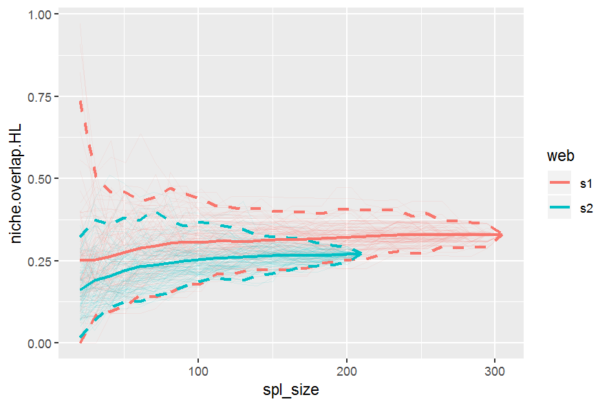
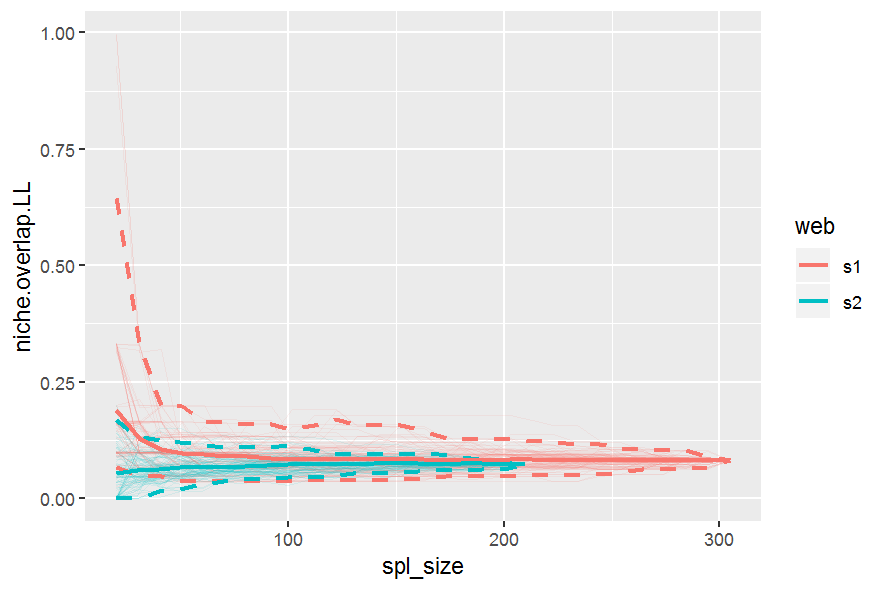


### Species-level indices (metrics)

#### Resample two networks with computing "betweenness".

Compare "betweenness" of 'Alstroemeria aurea' (lower level species) between the two networks.
Also compare the betweenes of 'Allograpta.Toxomerus' (higher level species).

If you are interested only in the lower or higher level species computations, then set the parameter `level` accordingly (`level = 'lower'` or `level = 'higher'`). In such cases, then specify only one of the `sp_lower` and `sp_higher` in the plotting functions `gg_specieslevel_compare_webs` or `gg_specieslevel_web_by_web`.

``` r
lst_btw <- list(s1 = Safariland_1, s2 = Safariland_2) %>%
  lapply(web_matrix_to_df) %>%
  boot_specieslevel(col_lower = "lower", # column name for plants
                    col_higher = "higher", # column name for insects
                    index = "betweenness",
                    level = "both", # for both levels (lower & higher)
                    start = 20,
                    step = 20,
                    n_boot = 100,
                    n_cpu = 3)

btw_comp_Aa_At_gg <- lst_btw %>%
  get_stats_multi() %>%
  gg_specieslevel_compare_webs(sp_lower = "Alstroemeria aurea",
                               sp_higher = "Allograpta.Toxomerus")
btw_comp_Aa_At_gg # plot all
```

<!--
saveRDS(lst_btw, file = "man/figures/README-example-betweenness-1-lst.rds")
lst_btw <- readRDS(file = "man/figures/README-example-betweenness-1-lst.rds")

ggsave(filename = "man/figures/README-example-betweenness-LL.png",
       plot = btw_comp_Aa_At_gg$lower_level,
       width = 15, height = 10, units = "cm", dpi = 150)
ggsave(filename = "man/figures/README-example-betweenness-LLW.png",
       plot = btw_comp_Aa_At_gg$lower_level_weighted,
       width = 15, height = 10, units = "cm", dpi = 150)
ggsave(filename = "man/figures/README-example-betweenness-HL.png",
       plot = btw_comp_Aa_At_gg$higher_level,
       width = 15, height = 10, units = "cm", dpi = 150)
ggsave(filename = "man/figures/README-example-betweenness-HLW.png",
       plot = btw_comp_Aa_At_gg$higher_level_weighted,
       width = 15, height = 10, units = "cm", dpi = 150)
-->

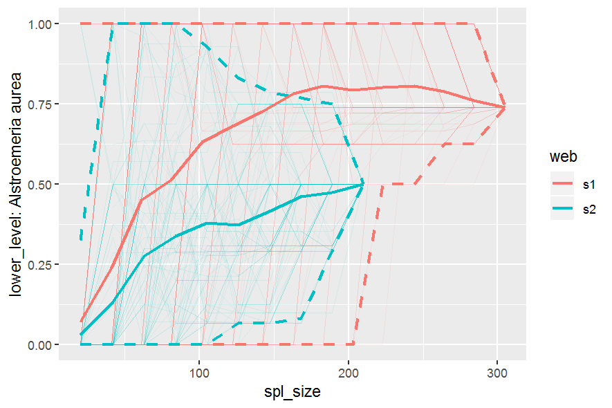
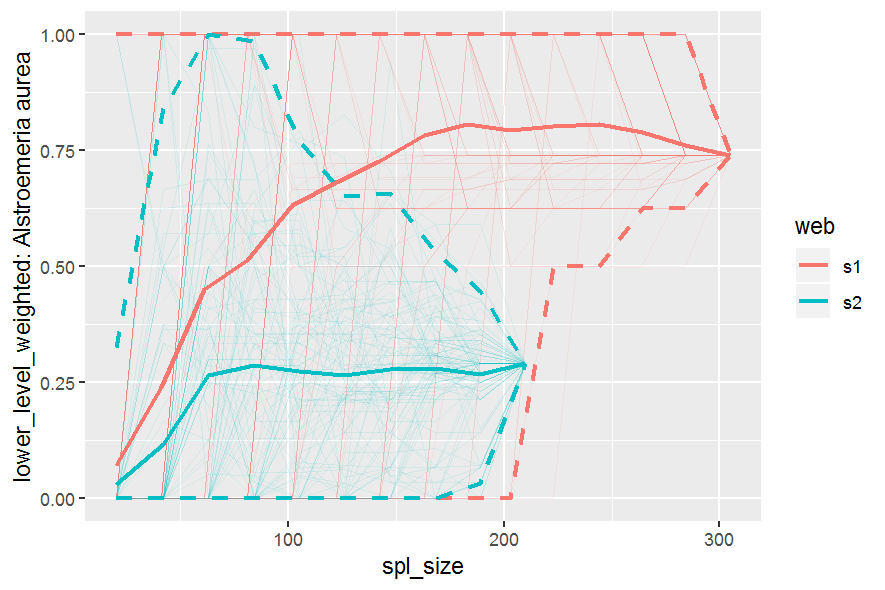
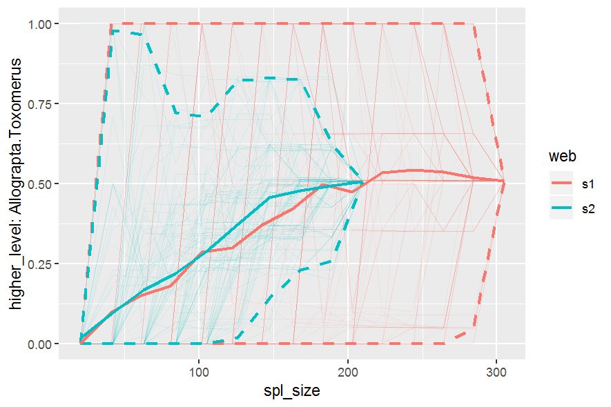
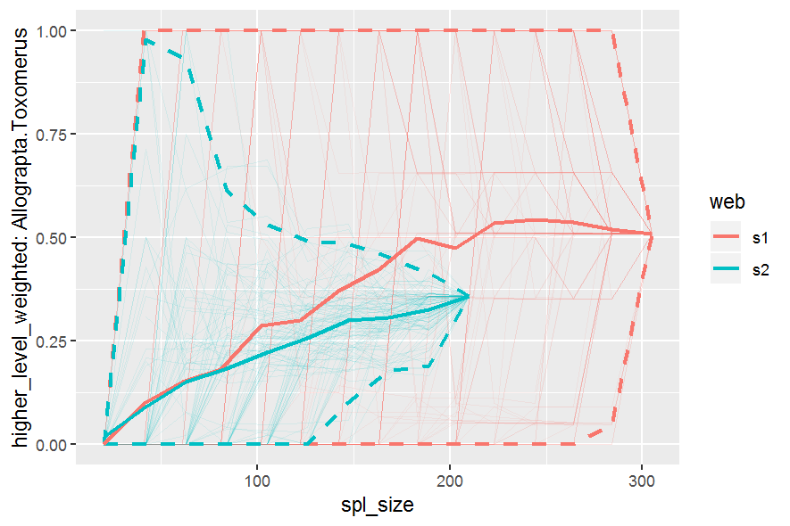


Plot resampled betweenness of all species at both levels of selected common species.

Selected common species:

``` r
common_lower_sp <- intersect(rownames(Safariland_1), rownames(Safariland_2))
common_higher_sp <- intersect(colnames(Safariland_1), colnames(Safariland_2))

btw_sp_webs_gg <- lst_btw %>%
  gg_specieslevel_web_by_web(sp_lower = common_lower_sp[1:5],
                             sp_higher = common_higher_sp[1:5])

btw_sp_webs_gg
```

<!--
ggsave(filename = "man/figures/README-example-betweenness-common-sp-S1LL.png",
       plot = btw_sp_webs_gg$s1.lower_level,
       width = 15, height = 10, units = "cm", dpi = 150)
ggsave(filename = "man/figures/README-example-betweenness-common-sp-S1LLW.png",
       plot = btw_sp_webs_gg$s1.lower_level_weighted,
       width = 15, height = 10, units = "cm", dpi = 150)
ggsave(filename = "man/figures/README-example-betweenness-common-sp-S1HL.png",
       plot = btw_sp_webs_gg$s1.higher_level,
       width = 15, height = 10, units = "cm", dpi = 150)
ggsave(filename = "man/figures/README-example-betweenness-common-sp-S1HLW.png",
       plot = btw_sp_webs_gg$s1.higher_level_weighted,
       width = 15, height = 10, units = "cm", dpi = 150)

ggsave(filename = "man/figures/README-example-betweenness-common-sp-S2LL.png",
       plot = btw_sp_webs_gg$s2.lower_level,
       width = 15, height = 10, units = "cm", dpi = 150)
ggsave(filename = "man/figures/README-example-betweenness-common-sp-S2LLW.png",
       plot = btw_sp_webs_gg$s2.lower_level_weighted,
       width = 15, height = 10, units = "cm", dpi = 150)
ggsave(filename = "man/figures/README-example-betweenness-common-sp-S2HL.png",
       plot = btw_sp_webs_gg$s2.higher_level,
       width = 15, height = 10, units = "cm", dpi = 150)
ggsave(filename = "man/figures/README-example-betweenness-common-sp-S2HLW.png",
       plot = btw_sp_webs_gg$s2.higher_level_weighted,
       width = 15, height = 10, units = "cm", dpi = 150)
-->

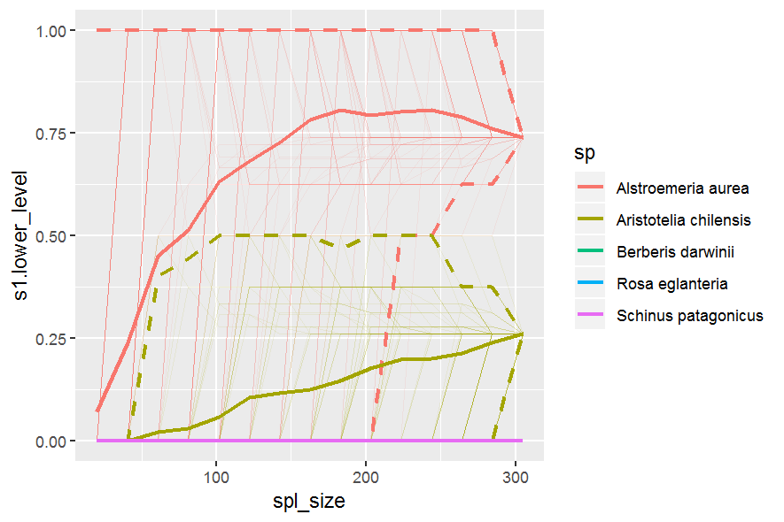
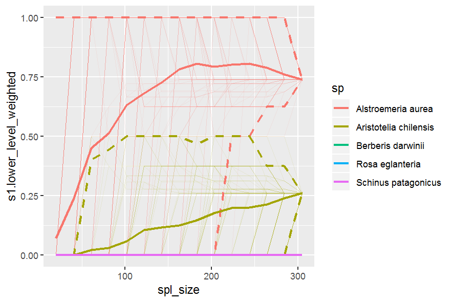
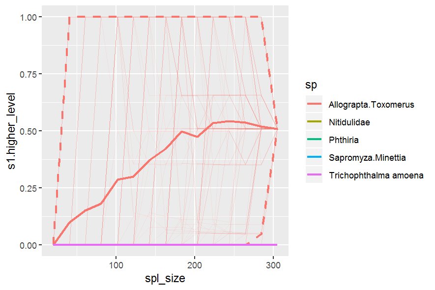
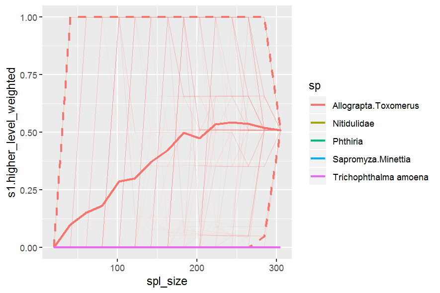
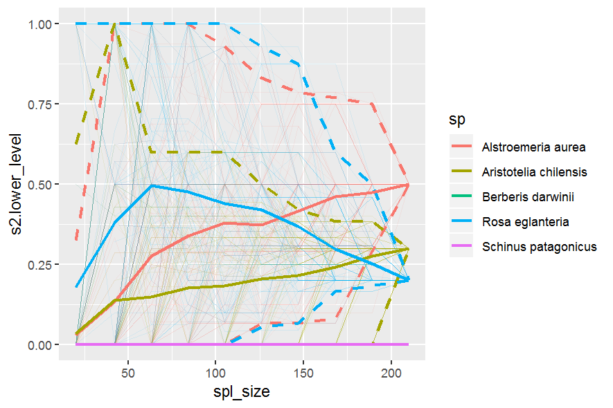
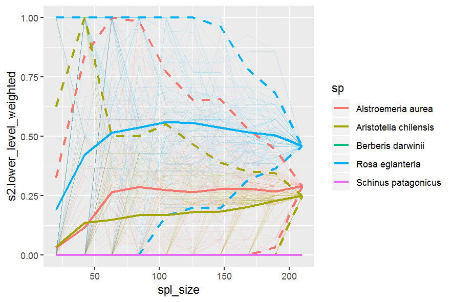
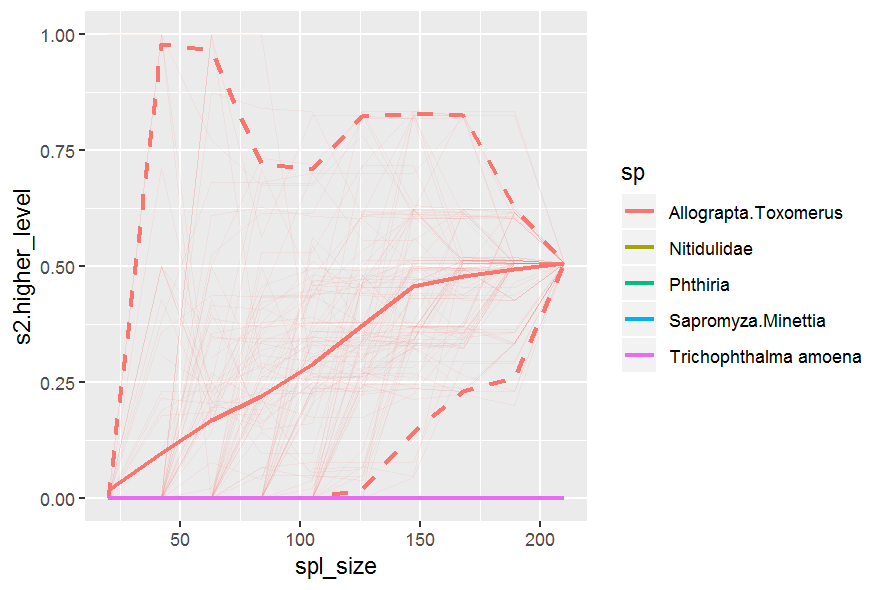
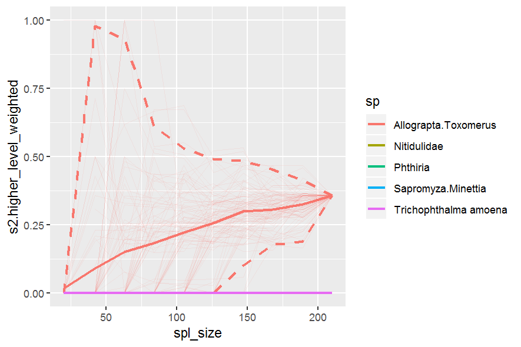

To plot betweenness of all species at all levels for each web/network, just leave the parameters `sp_lower` and `sp_higher` to default to `NULL`.

``` r
btw_sp_webs_gg_all <- lst_btw %>%
  gg_specieslevel_web_by_web()
```
