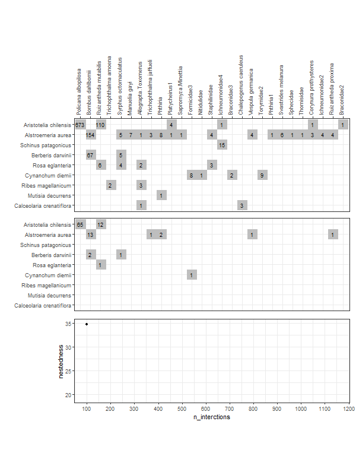

# Overview

R package for resampling network metrics/indices (bootstrapping without replacement).

It wraps around the [bipartite][bip] package functions `networklevel` and `specieslevel`. 

Assuming a network/web like `Safariland` from the bipartite package:

``` r
library(bipartite)
data(Safariland)
```
One can sample interactions without replacement from the network until all interactions have been used. The sampling procedure starts with a small sample size to which interactions are added until all are consumed. Every time we sample interactions, a smaller version of the entire network can be built and a network index/metric can be computed. The sampling procedure can be repeated as many times as needed, giving the possibility to compute mean values with quantile-based confidence intervals. The mean values across sample sizes can be plotted and indices of different networks can be visually compared. See examples below.

[bip]: https://cran.r-project.org/web/packages/bipartite/index.html

Below is an animation of the sampling method (one iteration). A detailed explanation of the method can be found [here](https://valentinitnelav.github.io/bootstrapnet/explain-sampling-method.html).



# Installation

You can install `bootstrapnet` from GitHub with:

``` r
# install.packages("devtools")
devtools::install_github("valentinitnelav/bootstrapnet")
```
